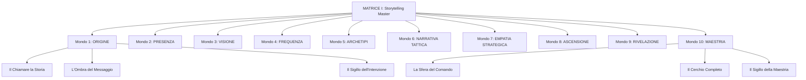
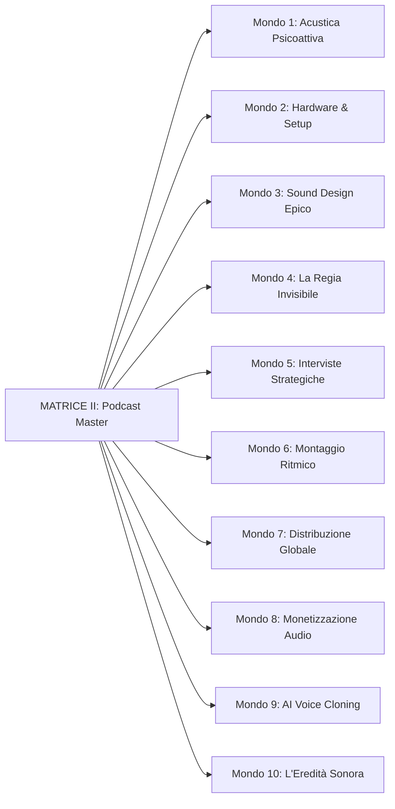
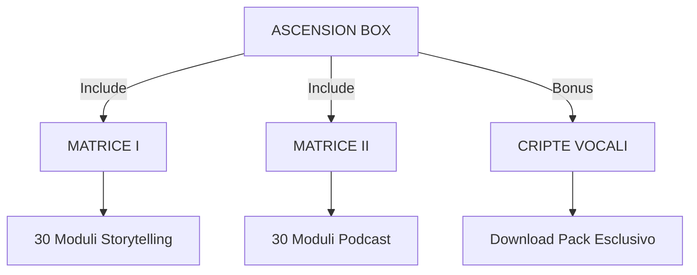
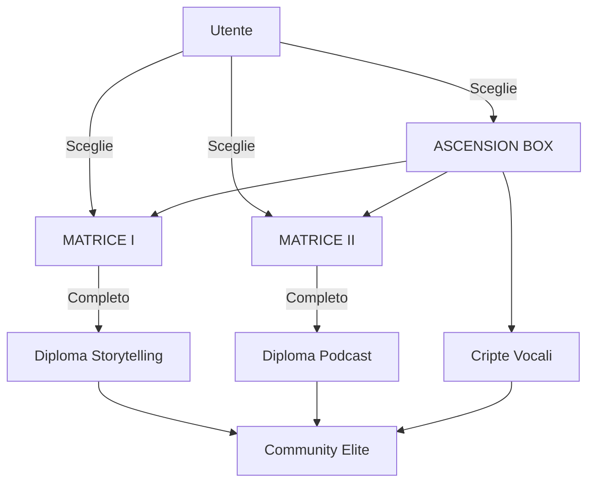

# VOX LUX STRATEGY - Struttura Completa dei Corsi

## 📚 Panoramica del Sistema Educativo

Il sistema **Vox Lux Strategy** è composto da **3 Prodotti Principali**:

1. **MATRICE I: Storytelling Strategy Master** - 10 Masterminds, 30 Moduli
2. **MATRICE II: Vox Podcast Master** - 10 Masterminds, 30 Moduli
3. **ASCENSION BOX: Ultimate Combo** - Accesso Totale (60 Moduli + Bonus)

**Totale:**
- 🌌 **20 Masterminds (Mondi)**
- 🎯 **60 Moduli Intensivi**
- ⏱️ **~30 Ore di Contenuto Premium**
- 🎓 **2 Diplomi NFT Certificati**
- 🔐 **1 Archivio Bonus Esclusivo**

---

## 🌟 MATRICE I: Storytelling Strategy Master

> *"Il percorso definitivo sulla Neuro-Narrativa e la Voce Strategica"*

### Filosofia
Ogni **Mastermind** rappresenta un **Mondo** nella "Galassia 3D".  
Ogni **Mondo** contiene **3 Moduli** (Sole, Luna, Thread):
- ☀️ **Sole (Logos)**: Tecnica, Struttura, Razionale
- 🌙 **Luna (Pathos)**: Psicologia, Emozione, Vulnerabilità
- ✨ **Thread (Praxis)**: Sintesi, Rituale, Output Pratico

### Struttura ad Albero



### Dettaglio Completo dei 10 Mondi

#### 🌑 Mondo 1: ORIGINE
*"Dove la storia respira per la prima volta"*

| Modulo | Titolo | Tipo | Durata | Output |
|--------|--------|------|--------|--------|
| 1.1 | Il Chiamare la Storia | Video | 18:00 | Prima Frase Rituale |
| 1.2 | L'Ombra del Messaggio | Audio | 12:30 | Emozione Madre |
| 1.3 | Il Sigillo dell'Intenzione | Video | 22:15 | Registrazione Intenzione (20s) |

---

#### 🌕 Mondo 2: PRESENZA
*"La tua voce è il primo mondo che costruisci"*

| Modulo | Titolo | Tipo | Durata | Output |
|--------|--------|------|--------|--------|
| 2.1 | La Spina Dorsale della Voce | Video | 20:00 | Stabilità Paraverbale |
| 2.2 | Il Punto di Sguardo (Archetipi) | Video | 18:45 | Avatar Vocale Dominante |
| 2.3 | La Firma Energetica | Video | 22:15 | Logo Sonoro Personale |

---

#### 👁️ Mondo 3: VISIONE
*"I narratori vedono mondi prima che esistano"*

| Modulo | Titolo | Tipo | Durata | Output |
|--------|--------|------|--------|--------|
| 3.1 | Il Teatro Interno | Video | 25:00 | Vista Cinematografica |
| 3.2 | La Mappa Invisibile | Video | 19:30 | Setting Canvas |
| 3.3 | La Camera dell'Immagine | Video | 22:00 | Sigillo della Visione |

---

#### 🌊 Mondo 4: FREQUENZA
*"La storia è un'onda. Impara a cavalcarla"*

| Modulo | Titolo | Tipo | Durata | Output |
|--------|--------|------|--------|--------|
| 4.1 | Il Respiro del Racconto | Video | 21:00 | Il Metronomo Interiore |
| 4.2 | Il Tempo dell'Ascoltatore | Video | 16:45 | Pacing Adattivo |
| 4.3 | Onde Emotive | Video | 18:30 | Sigillo della Frequenza |

---

#### 🎭 Mondo 5: ARCHETIPI
*"Indossa le maschere degli dei"*

| Modulo | Titolo | Tipo | Durata | Output |
|--------|--------|------|--------|--------|
| 5.1 | Il Custode (Chi è l'Eroe?) | Video | 20:00 | Posizionamento Guida |
| 5.2 | L'Eroe Ferito (Il Difetto Fatale) | Video | 19:00 | Vulnerabilità Strategica |
| 5.3 | L'Antagonista Invisibile | Video | 22:00 | Sigillo degli Archetipi |

---

#### ⚔️ Mondo 6: NARRATIVA TATTICA
*"La strategia è l'arte della guerra senza sangue"*

| Modulo | Titolo | Tipo | Durata | Output |
|--------|--------|------|--------|--------|
| 6.1 | Il Gancio di Ingresso (The Hook) | Video | 18:00 | Pattern Interrupt |
| 6.2 | Il Percorso dell'Attesa (Open Loops) | Video | 21:00 | Spirale di Tensione |
| 6.3 | Il Punto di Rottura (Plot Twist) | Video | 20:00 | Sigillo della Tattica |

---

#### 💖 Mondo 7: EMPATIA STRATEGICA
*"Connettersi è vincere"*

| Modulo | Titolo | Tipo | Durata | Output |
|--------|--------|------|--------|--------|
| 7.1 | Ascoltare il Non Detto | Video | 20:00 | Decodifica Emotiva |
| 7.2 | Il Calore della Voce | Video | 18:00 | Prossimità Vocale |
| 7.3 | La Mano sulla Spalla | Video | 22:00 | Sigillo dell'Empatia |

---

#### 🔥 Mondo 8: ASCENSIONE
*"Oltre la tecnica, c'è lo spirito"*

| Modulo | Titolo | Tipo | Durata | Output |
|--------|--------|------|--------|--------|
| 8.1 | Il Viaggio del Cambiamento | Video | 23:00 | Mappa della Trasformazione |
| 8.2 | Il Fuoco della Decisione | Video | 20:00 | Chiamata al Coraggio |
| 8.3 | Il Rito dell'Avanzamento | Video | 25:00 | Sigillo dell'Ascensione |

---

#### 💎 Mondo 9: RIVELAZIONE
*"La verità è l'unica moneta"*

| Modulo | Titolo | Tipo | Durata | Output |
|--------|--------|------|--------|--------|
| 9.1 | La Pelle che si Toglie | Video | 19:00 | Essenzialità Radicale |
| 9.2 | La Voce Nuda | Video | 21:00 | Fiducia Istintiva |
| 9.3 | La Soglia della Verità | Video | 24:00 | Sigillo della Rivelazione |

---

#### 👑 Mondo 10: MAESTRIA
*"La storia è tua. Falla brillare"*

| Modulo | Titolo | Tipo | Durata | Output |
|--------|--------|------|--------|--------|
| 10.1 | La Sfera del Comando (Public Speaking) | Video | 24:00 | Dominio Scenico |
| 10.2 | Il Cerchio Completo (Ring Composition) | Video | 18:30 | La Chiusura Perfetta |
| 10.3 | Il Sigillo della Maestria | Video | 35:00 | Diploma + Community |

---

## 🎧 MATRICE II: Vox Podcast Master

> *"Ingegneria Acustica e design di esperienze sonore immersive"*

### Filosofia
La **Matrice II** è complementare alla Matrice I.  
Si concentra sulla **Tecnologia**, **Audio Engineering** e **AI Voice**.

### Struttura dei 10 Mondi



### Dettaglio dei 10 Mondi (Schema Standardizzato)

Ogni Mondo della Matrice II segue questo pattern:

| Mondo | Tema | Modulo 1 | Modulo 2 | Modulo 3 |
|-------|------|----------|----------|----------|
| 1 | Acustica Psicoattiva | Setup della Cripta | Frequenze Alpha | Mix & Master Luxury |
| 2 | Hardware & Setup | Setup della Cripta | Frequenze Alpha | Mix & Master Luxury |
| 3 | Sound Design Epico | Setup della Cripta | Frequenze Alpha | Mix & Master Luxury |
| 4 | La Regia Invisibile | Setup della Cripta | Frequenze Alpha | Mix & Master Luxury |
| 5 | Interviste Strategiche | Setup della Cripta | Frequenze Alpha | Mix & Master Luxury |
| 6 | Montaggio Ritmico | Setup della Cripta | Frequenze Alpha | Mix & Master Luxury |
| 7 | Distribuzione Globale | Setup della Cripta | Frequenze Alpha | Mix & Master Luxury |
| 8 | Monetizzazione Audio | Setup della Cripta | Frequenze Alpha | Mix & Master Luxury |
| 9 | AI Voice Cloning | Setup della Cripta | Frequenze Alpha | Mix & Master Luxury |
| 10 | L'Eredità Sonora | Setup della Cripta | Frequenze Alpha | Mix & Master Luxury |

> [!NOTE]
> La Matrice II utilizza un template standardizzato per i moduli, con contenuti personalizzati per ciascun tema.

**Output per Mondo:**
- Schema Acustico (Modulo 1)
- Sound Pack Base (Modulo 2)
- Master Template (Modulo 3)

**Durate:**
- Modulo 1: 18:45
- Modulo 2: 12:00
- Modulo 3: 35:00

---

## 🔮 ASCENSION BOX: Ultimate Combo

> *"L'accesso totale alla conoscenza proibita"*

### Contenuto

L'**Ascension Box** NON è un corso separato, ma un **PORTALE UNIFICATO** che contiene:

1. ✅ **Accesso Completo a Matrice I** (30 Moduli Storytelling)
2. ✅ **Accesso Completo a Matrice II** (30 Moduli Podcast)
3. 🎁 **BONUS ESCLUSIVO: CRIPTE VOCALI**
   - Archivio segreto di prompt AI
   - Voci Clone premium
   - Sound Pack esclusivi



### Moduli

| ID | Titolo | Tipo | Descrizione |
|----|--------|------|-------------|
| ab-1 | Accesso Matrice I | Link | Redirect ai protocolli di Storytelling |
| ab-2 | Accesso Matrice II | Link | Redirect ai protocolli Audio |
| ab-3 | CRIPTE VOCALI (Bonus) | Download | Archivio segreto di prompt e voci AI |

---

## 📊 Statistiche Globali

### Per Corso

| Corso | Mondi | Moduli | Durata Stimata | Certificazione |
|-------|-------|--------|----------------|----------------|
| Matrice I | 10 | 30 | ~15 ore | Diploma NFT Storytelling |
| Matrice II | 10 | 30 | ~15 ore | Diploma NFT Podcast |
| Ascension Box | 1 (Portale) | 3 (+ 60 via link) | ~30 ore | Doppio Accesso |

### Tipologia Contenuti (Matrice I)

- 🎥 **Video**: 28 moduli
- 🎵 **Audio**: 1 modulo
- 📄 **Text**: 1 modulo

### Durate Medie

- **Modulo Breve**: 12-18 minuti
- **Modulo Standard**: 19-22 minuti
- **Modulo Intensivo**: 23-35 minuti

---

## 🎯 Percorsi di Apprendimento Consigliati

### Path 1: "Il Narratore"
1. Completa **Matrice I** (10 Mondi)
2. Ottieni Diploma Storytelling
3. Entra nella Community Elite

### Path 2: "Il Tecnico"
1. Completa **Matrice II** (10 Mondi)
2. Ottieni Diploma Podcast Master
3. Accedi agli strumenti AI

### Path 3: "L'Asceso" (Consigliato)
1. Acquista **Ascension Box**
2. Completa **Matrice I + II** in parallelo
3. Ottieni **Doppia Certificazione**
4. Sblocca **Cripte Vocali**

---

## 🔗 Interconnessioni



---

## 📐 Architettura Tecnica

### File Structure

```
services/courses/
├── index.ts           # Export centrale
├── types.ts           # Interfacce TypeScript
├── matrice1.ts        # 10 Masterminds Storytelling (341 righe)
├── matrice2.ts        # 10 Masterminds Podcast (44 righe, pattern)
├── ascensionBox.ts    # Portale unificato (40 righe)
├── matrice1Quiz.ts    # Quiz certificazione
├── matrice2Quiz.ts    # Quiz certificazione
└── matrice1Diploma.ts # Spec diploma NFT
```

### Data Model

```typescript
Course {
  id: string
  title: string
  description: string
  masterminds: Mastermind[] // 10 per corso
  quiz?: CourseQuiz
  diploma?: DiplomaSpec
}

Mastermind {
  id: string
  title: string
  subtitle: string
  modules: Module[] // 3 per Mastermind
}

Module {
  id: string
  title: string
  description: string
  output: string
  type: 'video' | 'audio' | 'text'
  duration: string
}
```

---

## 🎨 Visualizzazione 3D

Nella web app, i **Masterminds** sono rappresentati come:

- **Sephira Nodes** (Sfere 3D luminose)
- Disposte come **Tree of Life** (Albero Cabalistico)
- Collegate da **Linee Dorate** (Golden Thread)

### Mapping Visivo

| Mondo | Posizione 3D | Stato Visivo |
|-------|--------------|--------------|
| Mondo 1 | Base (0, -3.2, 0) | Primo Nodo Sbloccato |
| Mondo 2-9 | Livelli intermedi | Unlock Progressivo |
| Mondo 10 | Apex (0, 3.5, 0) | Corona della Maestria |

---

## 🏆 Sistema di Gamification

### Livelli Utente

1. **Acolyte** (Inizio)
2. **Adept** (5 Mondi completati)
3. **Master** (10 Mondi completati)
4. **Ascended** (20 Mondi completati)

### XP System

- Completare un Modulo: **100 XP**
- Completare un Mondo (3 Moduli): **500 XP**
- Completare una Matrice (10 Mondi): **5000 XP**
- Superare Quiz Finale: **2000 XP**

---

## 📱 Integrazione AI Tools

L'app include strumenti integrati:

- **Veo Video Gen**: Generazione video AI
- **Image Gen/Editor**: Copertine podcast
- **Live Audio**: Registrazione diretta
- **Transcribe**: Speech-to-text
- **TTS**: Text-to-Speech
- **General Task**: Assistant Gemini

Questi tool sono accessibili durante il corso per gli esercizi pratici.

---

## 🎓 Certificazione Finale

### Matrice I: Storytelling Diploma

> *"Certificato NFT di Maestria Narrativa"*

- **Modello 3D**: Corona dorata rotante
- **Animazioni**: Particelle luminose
- **Audio**: Voce narrante personalizzata
- **Metadata**: Nome, Data, Firma Digitale
- **Export**: PNG, MP4, JSON (blockchain-ready)

### Matrice II: Podcast Diploma

> *"Certificato NFT di Ingegneria Sonora"*

- **Modello 3D**: Forma d'onda 3D cristallizzata
- **Animazioni**: Pulsazione ritmica
- **Audio**: Beat signature
- **Metadata**: Skills certificate, Portfolio link
- **Export**: PNG, WEBM, Metadata JSON

---

## 📈 Roadmap Future

### Fase 1 (Attuale)
- ✅ Matrice I completa
- ✅ Matrice II template
- ✅ Ascension Box

### Fase 2 (Q2 2026)
- 🔄 Contenuti video reali (sostituire placeholder)
- 🔄 Community Discord integrata
- 🔄 Certificati NFT su blockchain

### Fase 3 (Q3 2026)
- 🔮 Matrice III: AI Voice Mastery
- 🔮 Live Masterclass mensili
- 🔮 Marketplace Template Voci

---

*Documento generato automaticamente da Vox Lux Strategy System*  
*Ultima modifica: 2026-02-04*
